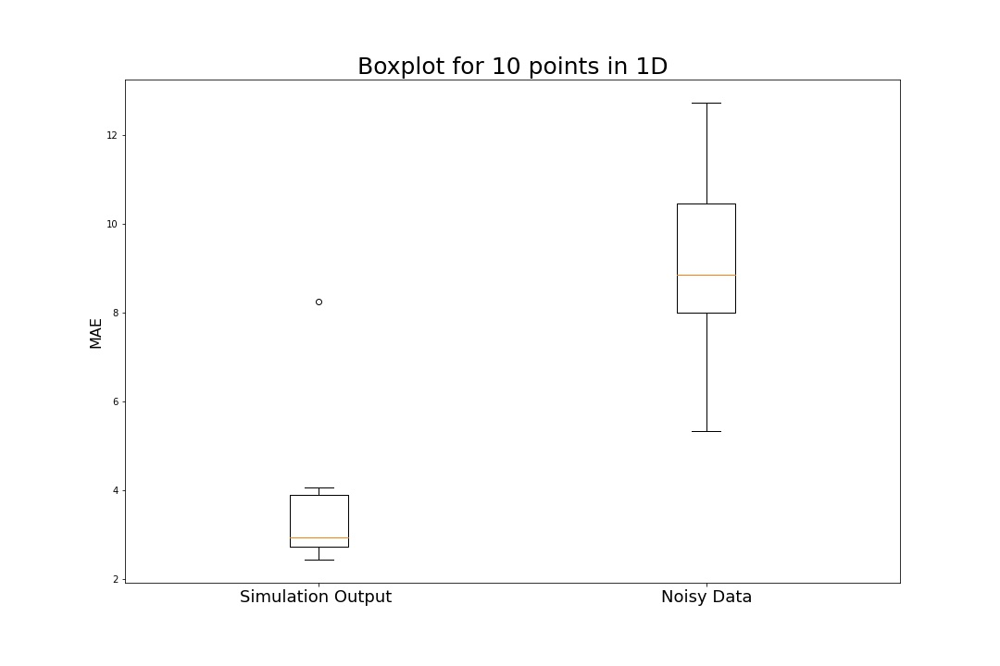
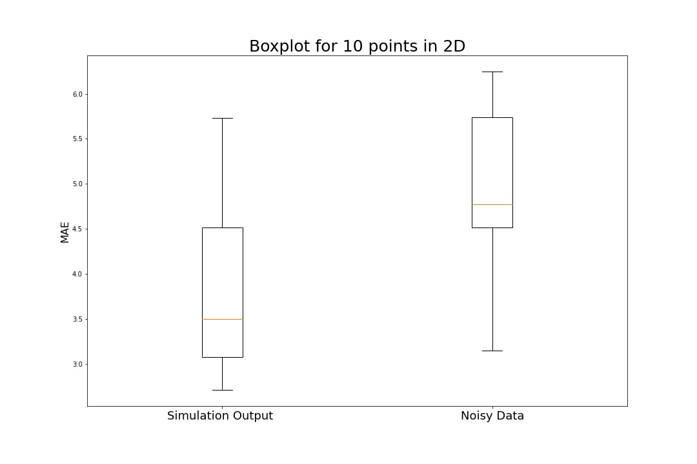
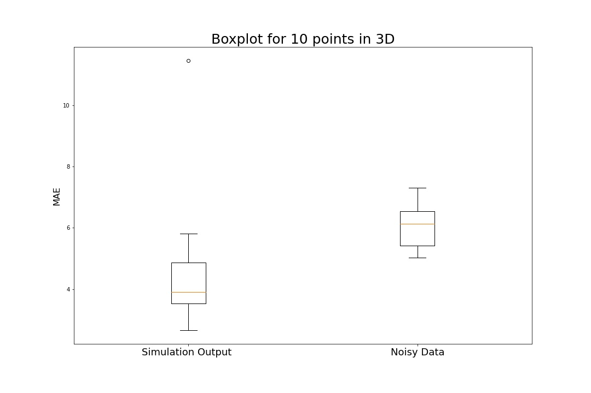
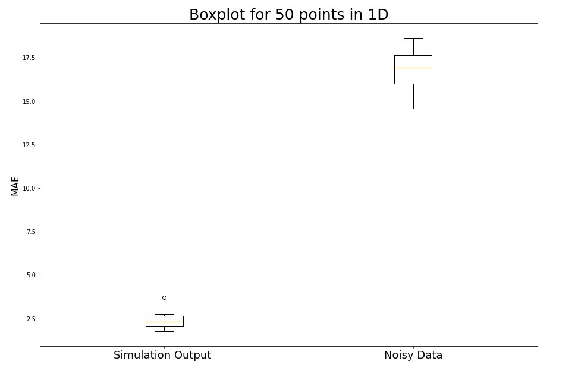
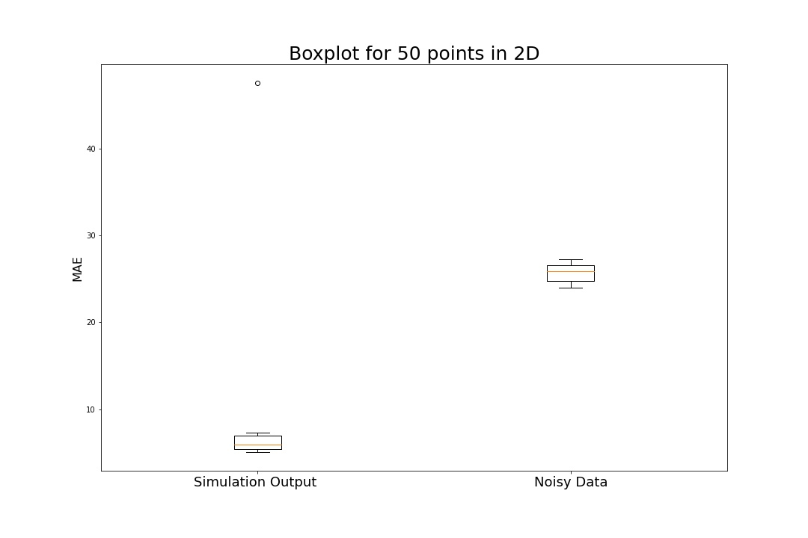
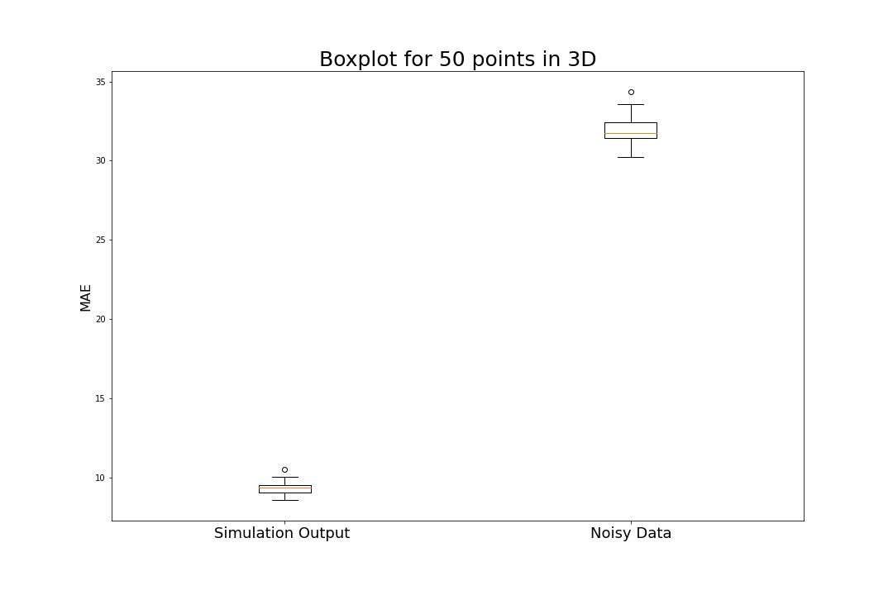
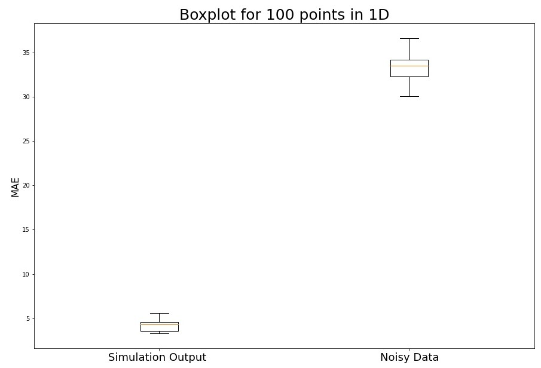
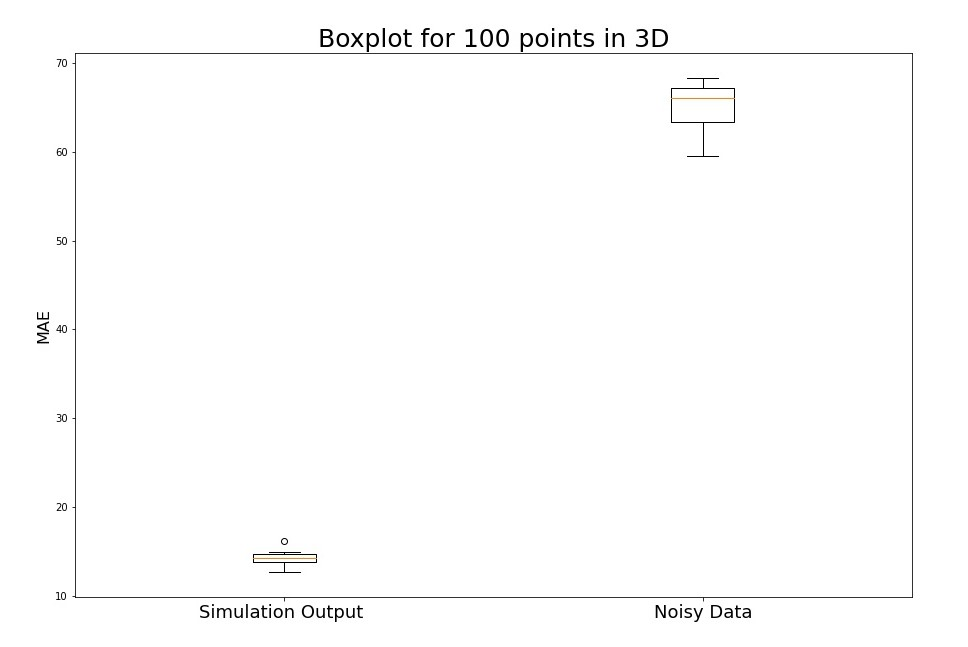

# Device location detection using noisy pairwise data

## Problem statement
We have an  𝑁  device. Each devices pair can measure the pairwise distance between them and return a measured value. Measurements can be noisy and contain outliers. We are presented with measured pairwise distance data. The goal is to find the approximate coordinates of each device.

We can call "true distances" and "true coordinates" to actual distances and coordinates of devices, measured without noise.

## Analogy to mechanical system

The problem can be translated to the mechanical system, where every pair of devices are connected using the springs. The unstretched length of each spring is equal to the noisy pairwise distance between those two devices.

In the initial state, we randomly place devices in the space. Initially, springs are deformed and act on devices. After release, the system will converge to the equilibrium, where the net force on each device is zero.

For solving the problem we should take the following steps:
1. Initialize points in the space
2. Calculate Forces acting to each point
3. Update point coordinates using forces calculated in step 2
4. Repeat steps 2 and 3 until the system goes to equilibrium or the maximum number of iterations is reached.

Each step and mathematical approach is further explained in 'Swarm.ipynb' notebook file.

## Results
For 1D, 2D, and 3D cases we build 10, 20, 50, and 100 device systems. We build 100 systems for each combination and calculate 2 Mean Absolute Errors:
* Between true distances and system output
* Between true distances and noisy distances

Results of the experiments are presented in the box plot format.

Boxplot 10 devices in 1D   |  Boxplot 10 devices in 2D | Boxplot 10 devices in 3D
:-------------------------:|:-------------------------:|:-------------------------:
|   |  

Boxplot 50 devices in 1D   |  Boxplot 50 devices in 2D | Boxplot 50 devices in 3D
:-------------------------:|:-------------------------:|:-------------------------:
|   |  

Boxplot 100 devices in 1D  |  Boxplot 100 devices in 3D
:-------------------------:|:-------------------------:
|  

It is visible on box plots, that:
* The mean error of the simulation outputs is much less than the noisy distance error.
* Mean error of the simulation outputs decreases by increasing the number of devices.
* Error is reduced on average  2-10 times. The reduction rate is much higher for 50-100 devices.

We can conclude that the model performs better when there is a higher number of devices.   
**Note:**  Each system is subjected to a 20% relative error in distances.   

## Benefits of the approach:
Simple mathematical model with good results.  
It is not necessary to place each point close to the true coordinates. System converges to equilibrium for any initial, non-zero placement.   
The model is robust against outliers in the noisy data. Force scaling using **tanh** and high device count provides robustness against outliers in the noisy data.  
Method is general and can solve the problem in n-dimensional space. Solutions in 1-dimensional **(1D)** 2-dimensional **(2D)** and 3-dimensional **(3D)** spaces are included in notebook.

## Limitations:  
The complexity of the system increases drastically when the device number is greater than 100.

## Further Improvements:
Changing model convergence loop, as now it has a long tail while converging.  
Automatical update of hyperparameters for different dimensions and device count.   
Initialize coordinates to be closer to the actual distance. That will decrease convergence time. Can be achieved by discarding the majority of the data. For the N-dimensional system of M devices, only N\*M distance is necessary (From M*M noisy data) for initial "nearly correct" placement.  
Sometimes model performs purely (Outlier in Boxplot 10 devices 3D). It is essential to analyze edge cases and the source of error.
